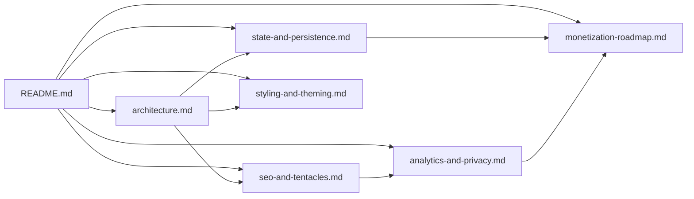

# TZGrid Documentation

This directory documents how TZGrid is built and where it might go next. It is intended for the project author returning after a break, future contributors, and anyone evaluating the codebase before extending it.

## What is TZGrid?

TZGrid is a free, browser-based timezone comparison tool built on Next.js 14 (App Router). It renders a column-per-timezone grid with day-and-night gradient backdrops driven by a 24-hour color interpolation. State lives entirely in the browser — there is no auth and no backend storage. A grid configuration round-trips through `localStorage` between sessions.

The product surface has two halves. The interactive app lives at `/app`. A static SEO layer (~31 city pages and ~189 city-pair comparison pages) generates organic search traffic and feeds users back into the live app via a `?add=` URL prefill mechanism.

## Quick Reference

| Command | Purpose |
| --- | --- |
| `npm run dev` | Start the dev server at `http://localhost:3000` |
| `npm run build` | Production build (also generates the static tentacle pages) |
| `npm run start` | Serve the production build |
| `npm run lint` | ESLint (Next.js config) |
| `npm run type-check` | `tsc --noEmit` |
| `npm run validate` | type-check + lint + build, in that order |

There is no test suite.

## Doc Map

| File | What it covers | Primary audience |
| --- | --- | --- |
| [architecture.md](./architecture.md) | System layers, route topology, component trees, data flow | Developer |
| [state-and-persistence.md](./state-and-persistence.md) | Zustand store, localStorage shape, sanitization, sorting | Developer |
| [seo-and-tentacles.md](./seo-and-tentacles.md) | Static city + comparison pages, canonical pair generation, the `?add=` CTA | Developer + product |
| [analytics-and-privacy.md](./analytics-and-privacy.md) | Google Analytics wiring, opt-out, what crosses the network boundary | Developer + product + legal |
| [styling-and-theming.md](./styling-and-theming.md) | Tailwind + CSS Modules layering, day/night palette, breakpoints | Developer + designer |
| [monetization-roadmap.md](./monetization-roadmap.md) | Four-phase revenue plan with engineering scope and privacy impact | Product + business |

## Local Development

```bash
git clone https://github.com/sphereboy/tzgrid.git
cd tzgrid
npm install
npm run dev
```

Open `http://localhost:3000`. Google Analytics only loads in `process.env.NODE_ENV === "production"`, so dev visits are never tracked. The Upstash dependencies (`@upstash/redis`, `@upstash/ratelimit`) are installed but not load-bearing today; environment variables are not required for local dev unless work specifically exercises the rate-limit path.

## Contributing Conventions

- TypeScript strict mode is on. No `any` without justification.
- Path alias `@/*` maps to `src/*` (see `tsconfig.json`).
- The interactive grid uses CSS Modules (`src/styles/TimeZoneComparer.module.css`); everything else is Tailwind. See [styling-and-theming.md](./styling-and-theming.md) for the decision rule.
- Run `npm run validate` before opening a PR.
- No emojis in UI copy or commit messages.
- Conventional Commits — recent history uses `feat:`, `fix:`, `chore:` consistently.

## How These Docs Connect



Start at `architecture.md` for a system-level picture, then branch into whichever subsystem you need.
