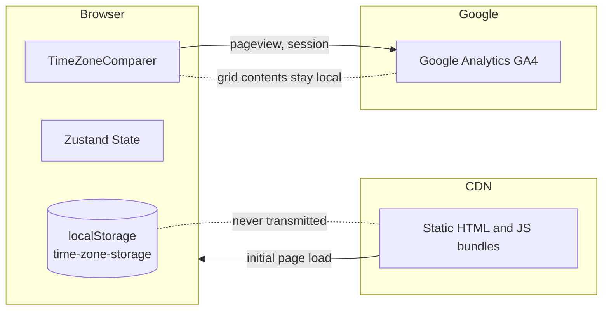

# Analytics and Privacy

What is collected, what is not, and the mechanisms behind both. This doc is the developer-facing companion to the public `/privacy` page; the two should stay aligned.

Source files: `src/app/layout.tsx`, `src/app/privacy/page.tsx`, `src/app/terms/page.tsx`. Related: [seo-and-tentacles.md](./seo-and-tentacles.md), [monetization-roadmap.md](./monetization-roadmap.md).

## What Is Collected

- **Google Analytics 4** (measurement ID `G-X6F87S4SBR`) collects standard pageview, session, referrer, and engagement data. No custom events are instrumented today.
- That is the entire collection list.

## What Is Not Collected

- No accounts, no email, no payment data, no contact form submissions.
- No user-generated content (the contents of a user's grid) ever leaves the browser. The Zustand store's `partialize` writes only to `localStorage`, and no action calls a network endpoint.
- No first-party cookies are set by TZGrid. Cookies that appear in DevTools while using TZGrid are set by Google Analytics.
- No third-party trackers, advertising pixels, or social-media widgets are embedded.

## Network Boundary

Anything inside the `Browser` box stays in the browser. The only outbound flow is anonymous GA4 pageview data.

## Google Analytics Implementation

Located in `src/app/layout.tsx`, lines 110–137. Three `next/script` tags inside a `process.env.NODE_ENV === "production"` guard, so dev and localhost visits are never tracked.

1. **`ga-optout` script (`strategy="beforeInteractive"`)**

   Runs before any other script. Reads `?gaoff=1` / `?gaon=1` to set or clear `localStorage['ga-optout']`. If the flag is set, it sets `window['ga-disable-G-X6F87S4SBR'] = true` — the official GA opt-out hook. Wrapped in `try/catch` so a hostile localStorage (private browsing, quota exceeded, etc.) cannot break the page.

2. **`gtag.js` loader (`strategy="afterInteractive"`)**

   Loads the Google Tag Manager script from `googletagmanager.com`. Runs after page interactivity to keep the largest contentful paint clean.

3. **`google-analytics` config (`strategy="afterInteractive"`)**

   The standard `gtag('js', ...)` and `gtag('config', 'G-X6F87S4SBR')` initialization.

The opt-out script must run `beforeInteractive` because the GA loader checks `window['ga-disable-...']` immediately on load. Reordering the strategies would defeat the opt-out.

## Opt-Out Mechanism

To disable: append `?gaoff=1` to any TZGrid URL once. The flag is written to `localStorage('ga-optout')` and persists across sessions.

To re-enable: append `?gaon=1` to any TZGrid URL once.

Both flags are documented in the public privacy page (`src/app/privacy/page.tsx`, lines 70–75). The mechanism is sticky because it is localStorage-backed, but it is browser-and-device-scoped — clearing site data clears the opt-out.

Standard browser-level tracking protection (extensions, do-not-track, Brave Shields, Safari ITP) also works because GA is a third-party script. The `?gaoff=1` mechanism is offered for users who want a TZGrid-specific control without browser-wide changes.

## localStorage Privacy Boundaries

| Key | Set by | Contents | Leaves device? |
| --- | --- | --- | --- |
| `time-zone-storage` | Zustand persist | `locations[]` (with `offset` zeroed), `settings` | No |
| `ga-optout` | inline script | `"1"` if user opted out, otherwise absent | No |

Neither key is ever transmitted. The `time-zone-storage` blob in particular contains the user's full timezone-comparison configuration — what cities they care about, what they named them, what secondary labels they added (often teammate names or office labels). Keeping this local is the privacy guarantee that distinguishes TZGrid from server-backed alternatives.

## Privacy and Terms Pages

| Page | Source | Effective date |
| --- | --- | --- |
| `/privacy` | `src/app/privacy/page.tsx` | `EFFECTIVE_DATE` constant — currently May 4, 2026 |
| `/terms` | `src/app/terms/page.tsx` | matching date |

Both are `force-static`, indexed (`robots: index: true`), and use the shared `TentacleFooter`. Site identity values (`SITE_NAME`, `COMPANY_NAME`, `CONTACT_EMAIL`) come from `src/config/site.ts` so a re-brand or contact-email change is one edit.

## Privacy Posture for Future Features

Any feature that introduces new data flows — outbound network calls with user-derived content, accounts, or third-party processors — must update both this doc and the public `/privacy` page before shipping. The monetization roadmap pre-flags the inflection points:

| Phase | New data introduced | Privacy work required |
| --- | --- | --- |
| Phase 1 — affiliates and ads | Possibly an EthicalAds or Carbon Ads request (cookieless, content-based) | Add the named third party to `/privacy`; note that no new tracking is introduced |
| Phase 2 — one-time purchase | Customer email via Stripe webhook; a license key in localStorage | Add Stripe as a payment processor; describe license key (a random identifier) and what it gates |
| Phase 3 — accounts and teams | Email, OAuth tokens, server-side workspace state | Substantive rewrite; GDPR deletion endpoint; data retention policy |
| Phase 4 — platform / API | API key owners, rate-limit logs | API terms; log retention disclosure |

Each row maps to a concrete checklist item in [monetization-roadmap.md](./monetization-roadmap.md).

## Operational Notes

- The GA measurement ID is hardcoded in `src/app/layout.tsx`. Rotating it requires changes in three places: the loader URL, the config call, and the `window['ga-disable-...']` opt-out flag. A property migration is more involved than a typical config change — coordinate with whoever owns historical GA data.
- The Google site verification meta tag is wired through `metadata.verification.google` reading `process.env.NEXT_PUBLIC_GOOGLE_SITE_VERIFICATION`. It is optional in dev.
- Upstash rate-limiter (`src/lib/ratelimit.ts`) is wired but not currently invoked by any public route. If a future API route logs IPs, the privacy page needs a row about it.
