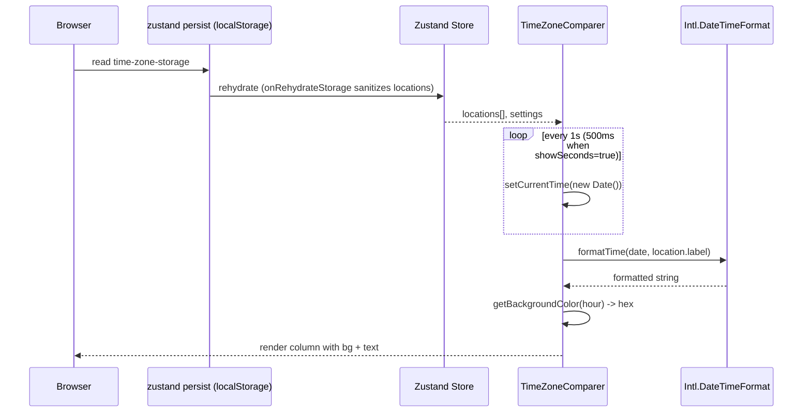
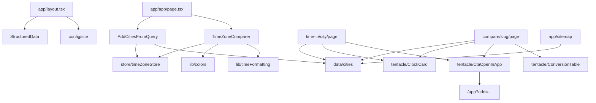

# Architecture

A system-level view of TZGrid: how routes are rendered, how the interactive grid is composed, and how data flows from user input through state to UI.

Related: [state-and-persistence.md](./state-and-persistence.md), [seo-and-tentacles.md](./seo-and-tentacles.md), [styling-and-theming.md](./styling-and-theming.md).

## System Layers

TZGrid splits into three layers. There is no application server, no database, and no auth.

1. **Static SSG.** Every public route except the live grid is rendered at build time. This includes the landing page, all tentacle pages, the privacy and terms pages, and `sitemap.xml` / `robots.txt`. These pages are pure HTML + JS bundles served from a CDN.
2. **Client-only interactive shell.** The `/app` route renders a static shell, then mounts the interactive grid (`TimeZoneComparer`) via `next/dynamic` with `ssr: false`. Hydration mismatch is avoided by deferring the localStorage read until after mount.
3. **Edge utility.** `@upstash/redis` and `@upstash/ratelimit` are wired in `package.json` and `src/lib/ratelimit.ts`, ready for use by future API routes. Today they are not load-bearing — no public route invokes them.

## Route Topology

| Route pattern | Rendering mode | Source |
| --- | --- | --- |
| `/` | SSG | `src/app/page.tsx`, `src/components/landing/*` |
| `/app` | Static shell + CSR | `src/app/app/page.tsx` (mounts `AddCitiesFromQuery` + `TimeZoneComparer`) |
| `/time-in/[city]` | `force-static`, ~31 pages | `src/app/time-in/[city]/page.tsx` |
| `/compare/[slug]` | `force-static`, 189 pages | `src/app/compare/[slug]/page.tsx`, `dynamicParams = false` |
| `/privacy` | `force-static` | `src/app/privacy/page.tsx` |
| `/terms` | `force-static` | `src/app/terms/page.tsx` |
| `/sitemap.xml` | Next.js handler | `src/app/sitemap.ts` |
| `/robots.txt` | Next.js handler | `src/app/robots.ts` |

The 189 compare pages come from 7 hub × 24 non-hub plus 7-choose-2 hub-hub pairs (168 + 21). See [seo-and-tentacles.md](./seo-and-tentacles.md#canonical-pair-generation).

## Component Tree — `/app`

```
AppPage (src/app/app/page.tsx)
└── ErrorBoundary
    ├── AddCitiesFromQuery       (effect-only, returns null)
    └── TimeZoneComparer         (next/dynamic, ssr: false)
        ├── AddLocationDialog
        ├── Settings (gear icon → settings sheet)
        └── per-location columns
            ├── ClockDisplay (clickable hour, minute, seconds)
            ├── secondaryLabels list
            └── delete + label affordances
```

`AddCitiesFromQuery` is mounted inside the `/app` route specifically so the URL `?add=` prefill is wired only on this route.

## Component Tree — Tentacle Routes

```
CityPage  (src/app/time-in/[city]/page.tsx)
├── Breadcrumbs
├── ClockCard           (animated clock + day/night gradient)
├── city description prose
├── UTC offset + DST paragraph (uses doesObserveDST)
├── CtaOpenInApp        (link to /app?add=<slug>)
├── RelatedLinks        (up to 5 related compare pairs)
├── Faq                 (buildCityFaq)
└── TentacleFooter

ComparePage  (src/app/compare/[slug]/page.tsx)
├── Breadcrumbs
├── two ClockCards
├── offset diff sentence
├── ConversionTable     (hour-by-hour business overlap)
├── CtaOpenInApp        (link to /app?add=<slug1>,<slug2>)
├── RelatedLinks        (related pairs + both city pages)
├── Faq                 (buildCompareFaq)
└── TentacleFooter
```

## Data Flow — Live App



The 1s ticker is suspended whenever `isManuallyAdjusted` is true (the user has clicked an hour to scrub). That flag lives in component state, not the store, so it is never persisted across reloads. See [state-and-persistence.md](./state-and-persistence.md#manual-time-adjustment-flag).

## Data Flow — `?add=` URL Prefill

`CtaOpenInApp` on a tentacle page renders a link to `/app?add=slug1,slug2`. On arrival:

1. `AddCitiesFromQuery` mounts inside `/app`.
2. The effect reads `?add=`, splits on commas, lowercases, deduplicates, caps at 10 entries.
3. If `useTimeZoneStore.persist.hasHydrated()` is already true, apply immediately. Otherwise subscribe via `persist.onFinishHydration(apply)` and unsubscribe on cleanup.
4. For each slug, resolve via `getCityBySlug` and call `addLocation(name, timezone)`.
5. Strip `?add=` from the URL via `history.replaceState` so a refresh does not re-add.

Source: `src/components/AddCitiesFromQuery.tsx`. The hydration check at line 31 is load-bearing — without it, `addLocation` would race against the persisted state being merged in, and tentacle prefills could be silently overwritten.

## Key Abstractions

| Symbol | File | Role |
| --- | --- | --- |
| `TimeZoneLocation` | `src/types/Location.ts` | Core type: `id`, `name`, `label` (IANA tz), `offset`, `isCurrent`, optional `secondaryLabels` |
| `useTimeZoneStore` | `src/store/timeZoneStore.ts` | Single Zustand store for locations + settings + current time |
| `getBackgroundColor` | `src/lib/colors.ts` | 24-anchor RGB interpolation for day/night gradient |
| `isLightColor` | `src/lib/colors.ts` | W3C perceived-brightness threshold (155) for adaptive text |
| `getCityBySlug`, `generateCanonicalPairs`, `getRelatedPairsForCity`, `getRelatedPairsForCompare`, `doesObserveDST`, `getUtcOffsetString` | `src/data/cities.ts` | City catalog and pair-graph helpers |
| `StructuredData` | `src/components/StructuredData.tsx` | Inlines `WebApplication` JSON-LD; `dangerouslySetInnerHTML` is intentional (see comment in source) |
| `SITE_URL`, `SITE_NAME`, `SITE_TITLE`, `SITE_DESCRIPTION`, `COMPANY_NAME`, `CONTACT_EMAIL` | `src/config/site.ts` | Centralized site metadata; referenced by metadata, JSON-LD, privacy, terms |

## Module Dependency Map



## Constraints and Non-Goals

- **No SSR for the interactive grid.** The grid depends on `localStorage` and `Intl.DateTimeFormat` resolved against the client's timezone. Server-rendering would either produce a hydration mismatch or render a meaningless default. `next/dynamic` with `ssr: false` is the correct pattern.
- **No auth.** Adding accounts is an explicit Phase 3 decision; see [monetization-roadmap.md](./monetization-roadmap.md#phase-3--accounts-and-teams).
- **No telemetry on grid contents.** The cities a user compares never leave their browser. This is a privacy guarantee documented in [analytics-and-privacy.md](./analytics-and-privacy.md).
- **No build-time dependency on user data.** Tentacle pages are generated entirely from `src/data/cities.ts`. Adding cities is a data edit + build, no API calls.
