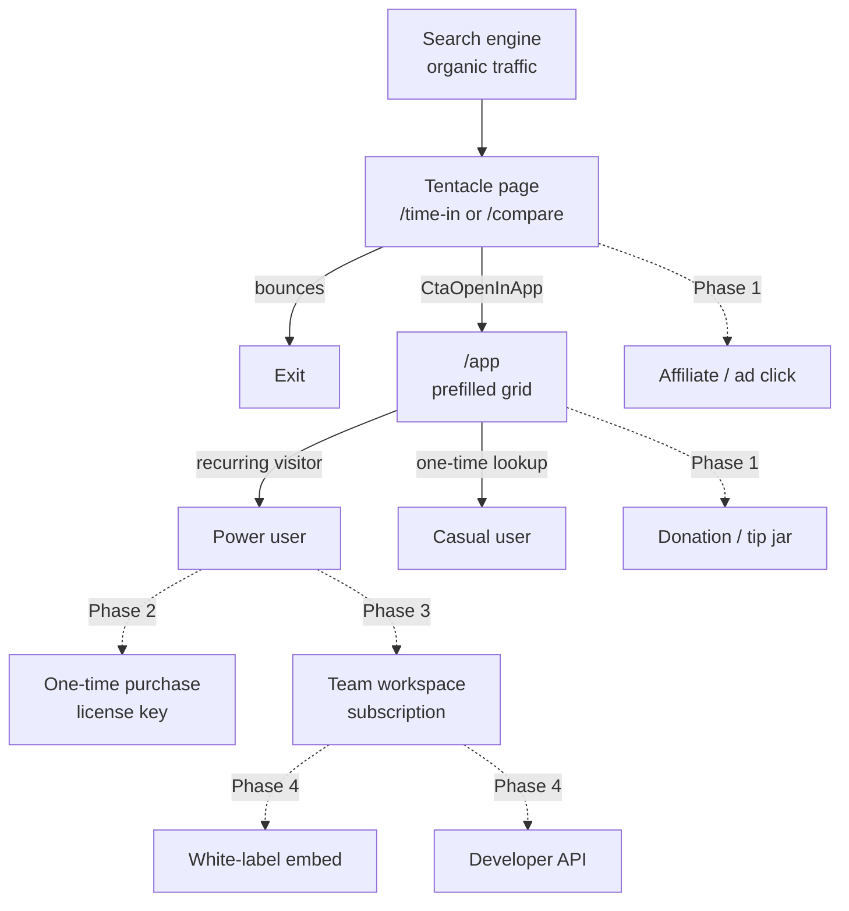
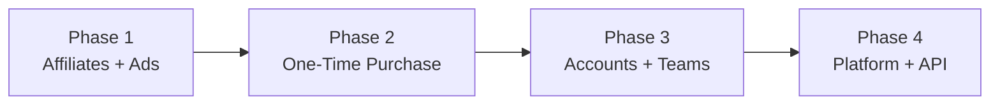

# Monetization Roadmap

A phased plan from the current free, no-auth, privacy-first baseline toward sustainable revenue. Each phase is grounded in the existing architecture and respects the privacy posture documented in [analytics-and-privacy.md](./analytics-and-privacy.md).

The phases are sequenced strictly: each one validates assumptions and funds the next. Skipping ahead is possible but expensive.

## Current Baseline

- Free, no auth, no payment infrastructure.
- Revenue: zero.
- Assets: ~31 city pages and 189 comparison pages indexed (see [seo-and-tentacles.md](./seo-and-tentacles.md)), plus a clean privacy posture and zero ads.
- Known about users: aggregate GA4 pageview data only. No grid contents, no PII.
- `src/components/StructuredData.tsx` declares `offers.price = "0"`. This becomes a touchpoint in Phase 2.

## Funnel Overview

## Phase 1 — Low-Friction Revenue (No Auth, No Backend)

**Hypothesis.** Tentacle visitors are intent-rich — they are planning international meetings, travel, or remote work. A small fraction will tip or click contextually relevant affiliate links. Privacy-respecting display ads (EthicalAds, Carbon Ads) earn meaningful CPM on a developer/remote-work audience without changing the privacy posture.

**Streams.**

1. **Affiliate links on `/compare/*` pages.** Travel booking (Skyscanner, Booking.com), remote-work tools (Deel, Wise for international payments), VPN services for travellers. One placement below `ConversionTable`, above `Faq`. Files: `src/app/compare/[slug]/page.tsx`, possibly a new `src/components/tentacle/AffiliateCard.tsx`.
2. **Affiliate links on `/time-in/*` pages.** Travel guides, weather/forecast apps, local SIM card services. One placement after the city description.
3. **Display ads in `TentacleFooter`.** EthicalAds (cookieless, content-based) or Carbon Ads (developer/design audience). Single ad unit, no per-page customization.
4. **Donation / tip link.** Buy Me a Coffee or Ko-fi link in the app footer area. Files: `src/components/TimeZoneComparer.tsx` or a sibling element.

**Engineering work.**

- No new routes, no new services, no new dependencies beyond the ad provider's snippet.
- Affiliate links are plain `<Link>` or `<a rel="nofollow sponsored">`.
- Ad provider integration mirrors the existing GA pattern in `src/app/layout.tsx` — a tagged `<Script>` and a placement `
`.

**Privacy impact.** EthicalAds is cookieless and content-targeted. Carbon Ads is similarly light. Neither materially changes the privacy posture, but `/privacy` (`src/app/privacy/page.tsx`) must name any new third-party processor.

**Risk.** Ads on tentacle pages do not affect `/app`. Users who bookmark the live grid never see ads. Low risk to core UX. The chief failure mode is choosing a misaligned affiliate program; treat the first placements as experiments and measure click-through.

**Sequencing dependency.** None. Buildable immediately.

## Phase 2 — One-Time Purchase (Light Backend)

**Hypothesis.** Power users — remote team coordinators, frequent international travellers, distributed engineering leads — will pay $9–$19 once for features that meaningfully improve their workflow. The no-account UX is preserved by issuing a license key via email, validated client-side against a thin endpoint.

**Features to gate.**

- Unlimited saved locations (gate at e.g. 5 free / unlimited paid).
- Export the grid as PNG/PDF (client-side `html2canvas` for PNG; serverless Puppeteer for PDF if required).
- Export overlapping business-hour windows as `.ics` calendar events. Reuses the data already computed by `ConversionTable`.
- Custom day/night palettes (overrides for `TIME_COLORS` from `src/lib/colors.ts`, persisted alongside settings).
- Free-form IANA timezone entry in `AddLocationDialog` (the free tier keeps the curated dropdown).

**Engineering work.**

| New file | Purpose |
| --- | --- |
| `src/app/api/checkout/route.ts` | Creates a Stripe Checkout session, returns the redirect URL |
| `src/app/api/webhook/stripe/route.ts` | Stripe webhook handler. On `checkout.session.completed`, generates a license key, stores it in Upstash Redis, emails it to the customer |
| `src/app/api/license/verify/route.ts` | Validates a license key against Upstash, returns `{ valid, features[] }`. Rate-limited via existing `@upstash/ratelimit`. |
| `src/components/LicenseGate.tsx` | Client component that reads the persisted license key and calls `/api/license/verify` once on mount |

**Store changes.** `src/store/timeZoneStore.ts` gains `licenseKey?: string` and `premiumFeatures?: string[]` fields, both persisted. Feature gates are checked inline (e.g., `AddLocationDialog` shows an upgrade prompt when `locations.length >= 5 && !premiumFeatures.includes("unlimited-locations")`).

**Other touch points.**

- `src/components/StructuredData.tsx` — extend the `offers` block to describe the paid tier. The free tier remains `price: "0"`.
- `package.json` — add `stripe`, `resend` (or `postmark`).
- New environment variables: `STRIPE_SECRET_KEY`, `STRIPE_WEBHOOK_SECRET`, `RESEND_API_KEY`.

**Privacy impact.** First introduction of PII handling. The `/api/webhook/stripe` route receives a customer email from Stripe. The license key in `localStorage` is a random identifier and does not encode personal data. `/privacy` requires a Stripe entry and a description of how email is used. No grid data crosses the network.

**Sequencing dependency.** Phase 1 should run first to validate audience size and willingness to engage with monetization at all.

## Phase 3 — Accounts and Teams (Subscription)

**Hypothesis.** Small distributed teams (3–15 people) will pay $5–$12 per seat per month, or $15–$40 flat, for a shared workspace, integrations, and a meeting-finder view.

**Features.**

- Named workspaces with shared, real-time-synced grids (`workspace/<id>` URL).
- Slack slash command (`/tzgrid`) returning the workspace's current grid as a text snapshot.
- Notion embed block.
- Meeting-finder view: highlight the hour window where all selected cities are within their working hours.
- Embeddable widget: a `<script>` tag that renders a stripped-down grid in any page with team-preset cities.

**Engineering work.**

| New file or area | Purpose |
| --- | --- |
| `src/app/api/auth/[...nextauth]/route.ts` | Auth provider. Magic link + OAuth. Likely NextAuth or Clerk. |
| `src/app/workspace/[id]/page.tsx` | Workspace view |
| `src/app/api/workspace/*` | CRUD for workspaces and shared grids |
| `src/app/api/integrations/slack/*` | Slack OAuth + slash command handler |
| `src/app/api/embed/[id]/route.ts` | Returns the widget JS bundle and config |

**Store changes.** Zustand gains a `workspaceId` and a `dirty` flag with debounced sync to `/api/workspace/[id]/grid`. The localStorage-only persistence remains the default for unauthenticated users.

**Stripe.** Upgrade from Checkout to Billing for subscriptions. Webhook handler extended for `customer.subscription.updated`, `customer.subscription.deleted`. Per-seat or per-workspace pricing modeled in Stripe products.

**Privacy impact.** Substantive. Accounts (email + OAuth provider tokens) and server-side storage of grid contents introduce two new data categories. Required:

- `/privacy` rewrite covering accounts, server-side storage, retention windows.
- `DELETE /api/user` endpoint that removes account, workspaces, and Stripe customer references in one transaction.
- GDPR/CCPA disclosure of data subject rights.

**Sequencing dependency.** Phase 2 must come first. Stripe customer relationships from Phase 2 extend cleanly into Stripe Billing in Phase 3.

## Phase 4 — Platform and White-Label

**Hypothesis.** Remote-work agencies, HR software companies, and global staffing firms want TZGrid's UX as a branded embedded widget or as a white-label tool. Speculative; only viable once Phase 3 has proven repeatable B2B revenue.

**Streams.**

- **White-label SaaS.** Custom domain, custom palette, custom logo. $99–$499 per month. Multi-tenancy in the workspace layer built in Phase 3.
- **Public developer API.** `GET /api/v1/cities`, `GET /api/v1/compare/<from>/<to>` returning offsets, DST status, and business-hour overlap. Rate-limited via existing `@upstash/ratelimit`. Free tier with paid usage tiers.
- **Region/data packs.** Extended catalog (smaller cities, US metros, airport IATA codes). Either community-contributed under a CC license or sold as add-ons.
- **Theme marketplace.** Third-party day/night palettes targeting `TIME_COLORS`. Revenue-share with palette authors.

**Engineering work.** Extensions of Phase 3. New API surface under `src/app/api/v1/`. White-label requires tenant-aware config in `src/app/layout.tsx` (subdomain or session-derived).

**Sequencing dependency.** All prior phases.

## Phase Sequencing

Within a phase, individual streams are independent (e.g., affiliate links and the donation link in Phase 1 can be built in parallel). Cross-phase dependencies are strict: no Phase 3 without Phase 2's payment infrastructure.

## Privacy Impact Register

| Phase | New PII | Required `/privacy` update | Engineering |
| --- | --- | --- | --- |
| 1 | None | Name third-party ad provider | Ad snippet placement |
| 2 | Customer email (Stripe webhook) | Add Stripe; describe license key | Webhook handler, Redis storage, license verify endpoint |
| 3 | Email, OAuth tokens, server-side grid data | Full rewrite; GDPR deletion | Auth provider, subscription billing, deletion endpoint |
| 4 | API key owner identity, rate-limit logs | API terms, log retention | API key issuance, logging |

## Stewardship Notes

- Treat `src/components/StructuredData.tsx`'s `offers.price` field as a tripwire. Update it the moment a paid tier ships, otherwise the JSON-LD misrepresents the product to crawlers.
- Treat `src/app/privacy/page.tsx`'s `EFFECTIVE_DATE` as load-bearing. Update it on every material privacy change in this register.
- The license-key UX in Phase 2 is a deliberate choice to preserve the no-account experience. Resist the pressure to introduce accounts before Phase 3 — the simplicity of "buy a key, paste it in" is itself a competitive feature.
