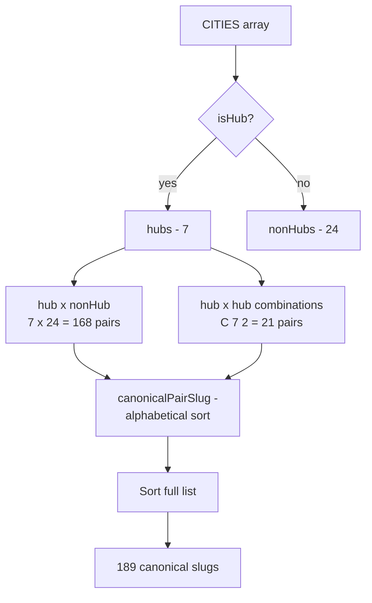
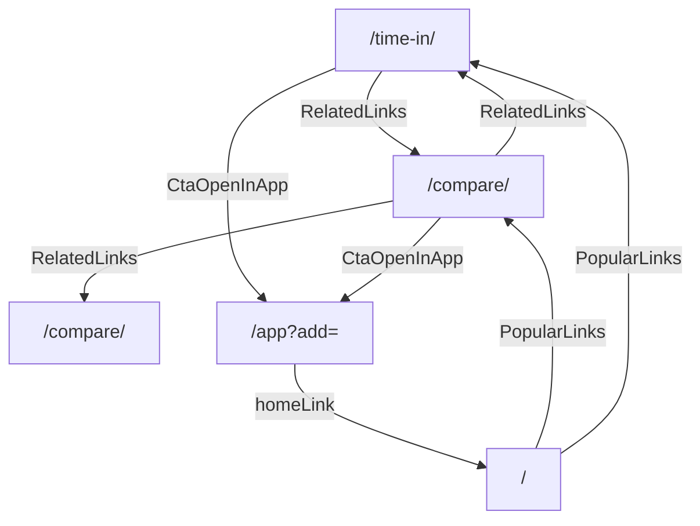

# SEO and Tentacle Pages

How the static SEO surface is generated, how it routes traffic into the live app, and how to extend it.

Source files: `src/data/cities.ts`, `src/app/time-in/[city]/page.tsx`, `src/app/compare/[slug]/page.tsx`, `src/components/tentacle/*`, `src/app/sitemap.ts`, `src/app/robots.ts`, `src/components/StructuredData.tsx`. Related: [architecture.md](./architecture.md), [analytics-and-privacy.md](./analytics-and-privacy.md), [monetization-roadmap.md](./monetization-roadmap.md).

## Strategy Overview

The product has two doors. The front door is `/` and `/app` — direct visits and bookmarks. The side door is the SEO tentacle layer: ~31 city pages and 189 city-pair comparison pages, all pre-rendered at build time. They rank for long-tail queries like "current time in tokyo" or "new york vs london time difference". Each page has a single primary CTA that opens the live app with the relevant cities pre-loaded.

The pages are pure marketing surface. They do not need a backend, they cache aggressively at the CDN, and they cost nothing to keep online. The only ongoing cost is build time — adding hub cities grows the pair set quadratically.

## City Catalog

The catalog lives in `src/data/cities.ts` as a plain TypeScript array. Each entry:

```ts
{
  slug: "tokyo",
  name: "Tokyo",
  country: "Japan",
  timezone: "Asia/Tokyo",     // IANA
  isHub: true,
  description: "...",
}
```

Today the catalog has 31 cities. Seven are flagged `isHub: true` (New York, London, Paris, Dubai, Tokyo, Sydney, Los Angeles). The hub flag controls which pairs are generated.

A `Map<slug, City>` is built once at module load (`CITY_BY_SLUG`) so `getCityBySlug` is O(1).

## Canonical Pair Generation

`generateCanonicalPairs()` builds two sets of pairs and sorts them.



The canonical slug is alphabetical:

```ts
[a, b].sort()[0] === a ? `${a}-vs-${b}` : `${b}-vs-${a}`
```

So `tokyo-vs-london` is rejected; the canonical form is `london-vs-tokyo`. `isCanonicalPairSlug(slug)` validates this. The compare route sets `dynamicParams = false`, so non-canonical slugs return 404 — there is exactly one URL per pair.

`getRelatedPairsForCity(slug, limit=5)` returns up to 5 pairs that include the given city. `getRelatedPairsForCompare(a, b, limit=4)` returns 4 pairs that share at least one city with the current pair, excluding the current pair itself. Both are used by `RelatedLinks`.

## Tentacle Page Templates

### `/time-in/[city]`

Composes:

- `Breadcrumbs`
- `ClockCard` — animated clock with day/night gradient backdrop (uses `getBackgroundColor` from `src/lib/colors.ts`)
- City `description` paragraph (from the catalog)
- UTC offset paragraph + DST status from `doesObserveDST` and `getUtcOffsetString`
- `CtaOpenInApp` — single CTA, links to `/app?add=<slug>`
- `RelatedLinks` — up to 5 compare pairs that include this city
- `Faq` (`buildCityFaq`)
- `TentacleFooter`

### `/compare/[slug]`

Composes:

- `Breadcrumbs`
- Two `ClockCard`s side by side
- Offset diff sentence
- `ConversionTable` — hour-by-hour grid showing where business hours overlap
- `CtaOpenInApp` — links to `/app?add=<slug1>,<slug2>`
- `RelatedLinks` — related pairs + both city pages
- `Faq` (`buildCompareFaq`)
- `TentacleFooter`

## CTA Prefill Mechanism

The whole point of the tentacle layer is funneling visitors into the live grid with the relevant cities already added. The mechanism is a URL parameter.

```mermaid
graph LR
  Tent[Tentacle page] -- click CTA --> Url["/app?add=slug1,slug2"]
  Url --> AppShell[/app static shell]
  AppShell --> AddCQ[AddCitiesFromQuery effect]
  AddCQ -- read ?add= --> Parse[split, lowercase, dedupe, cap at 10]
  Parse --> Hyd{persist hydrated?}
  Hyd -- yes --> Apply[addLocation per slug]
  Hyd -- no --> Wait[onFinishHydration -> Apply]
  Apply --> Clean[history.replaceState removes ?add=]
  Clean --> Grid[TimeZoneComparer renders]
```

Implementation: `src/components/AddCitiesFromQuery.tsx`. The hydration check is critical — without waiting for `persist.hasHydrated()`, the `addLocation` calls would race against the persisted state being merged in, and the prefilled cities could be silently overwritten.

`?add=` is additive. It does not replace the user's existing grid; it appends. Duplicate IANA timezones are deduplicated by `addLocation` itself (see [state-and-persistence.md](./state-and-persistence.md#actions-reference)).

## Structured Data and Metadata

`StructuredData` (`src/components/StructuredData.tsx`) inlines a `WebApplication` JSON-LD schema in the root layout. The script is `dangerouslySetInnerHTML` rather than `next/script` because Google reliably parses inline JSON-LD but inconsistently picks up deferred or externalized tags — the source comment explains this.

The schema's `offers.price` is `"0"`. When monetization Phase 2 ships, this field needs an update; see [monetization-roadmap.md](./monetization-roadmap.md#phase-2--one-time-purchase).

Per-page metadata is set via `generateMetadata` on each tentacle page: title (formatted through the root template `"%s | TZGrid"`), description, canonical URL, and OG/Twitter cards. Site-wide values come from `src/config/site.ts` (`SITE_URL`, `SITE_NAME`, `SITE_TITLE`, `SITE_DESCRIPTION`).

## Sitemap and Robots

`src/app/sitemap.ts` emits an XML sitemap covering every public route. Priorities (current values):

| Route | Priority |
| --- | --- |
| `/` | 1.0 |
| `/app` | 0.9 |
| `/time-in/[city]` (×31) | 0.6 |
| `/compare/[slug]` (×189) | 0.5 |
| `/privacy`, `/terms` | 0.3 |

`src/app/robots.ts` allows all user agents and points at the canonical sitemap URL.

## Internal Linking Graph



Every tentacle page links to other tentacle pages; every tentacle CTA points at `/app`; the app's `homeLink` points back at `/`. There are no orphan pages.

## Adding a City

1. Append a new entry to `CITIES` in `src/data/cities.ts`. Choose `isHub: true` only if the city anchors a regional cluster — hub status grows the pair count quadratically.
2. Run `npm run build`. The sitemap, static params for both tentacle routes, and related-link sets all regenerate automatically.
3. No code changes elsewhere are required.

If adding the 8th hub, the compare-page count jumps from 189 to 192 + (8 × new non-hub count). Mind the build time.

## Adding a New Tentacle Type

If a new tentacle page type is added (for example, "best meeting time between 3 cities"), it should:

- Live under `src/app/<route>/[param]/page.tsx`
- Use `force-static` and `generateStaticParams`
- Set `dynamicParams = false` if the param space is finite and known
- Compose the existing `Breadcrumbs`, `ClockCard`, `CtaOpenInApp`, `RelatedLinks`, `Faq`, `TentacleFooter` primitives
- Be added to `src/app/sitemap.ts` with an appropriate priority
- Append a row to the route topology table in [architecture.md](./architecture.md#route-topology)
