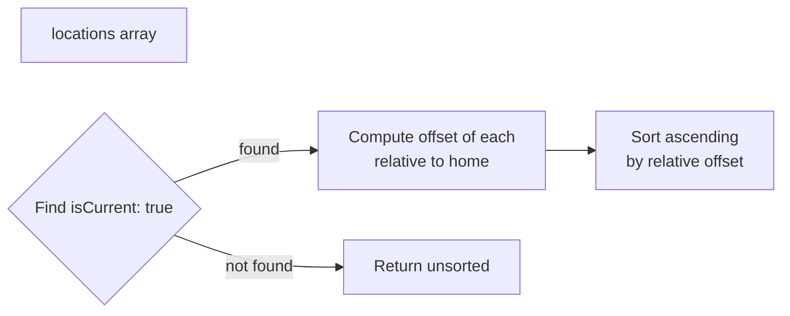
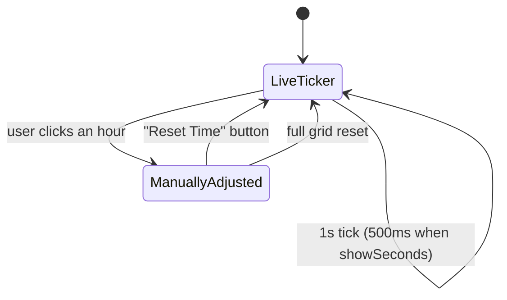

# State and Persistence

Reference for the Zustand store: shape, actions, what is persisted, how rehydration is sanitized, and the edge cases worth knowing about.

Source of truth: `src/store/timeZoneStore.ts`. Related: [architecture.md](./architecture.md), [monetization-roadmap.md](./monetization-roadmap.md).

## State Shape

```ts
interface TimeZoneState {
  locations: TimeZoneLocation[];
  currentTime: Date;
  settings: Settings;
  // actions...
}

interface Settings {
  showSeconds: boolean;
  use24HourFormat: boolean;
  showTimezoneAbbreviation: boolean;
  theme: "light" | "dark" | "system";
}
```

`TimeZoneLocation` is defined in `src/types/Location.ts`:

| Field | Type | Notes |
| --- | --- | --- |
| `id` | `string` | UUID for added locations; the literal `"current"` for the home location |
| `name` | `string` | User-visible label (e.g., "London") |
| `label` | `string` | IANA timezone string (e.g., `"Europe/London"`) |
| `offset` | `number` | Cached UTC offset in minutes; recomputed at render time, zeroed on persist |
| `isCurrent` | `boolean` | True for the device's home timezone; used as the sort anchor |
| `secondaryLabels` | `string[]?` | Optional user-added labels (e.g., teammate names) shown in the column |

## Settings Defaults

```ts
{ showSeconds: false, use24HourFormat: true, showTimezoneAbbreviation: true, theme: "system" }
```

All four are persisted. `theme: "system"` follows `prefers-color-scheme`; see [styling-and-theming.md](./styling-and-theming.md#theme-modes-light--dark--system).

## Actions Reference

| Action | Signature | Behaviour |
| --- | --- | --- |
| `addLocation` | `(name, label) => void` | No-op if a location with the same `label` already exists. Generates a UUID for `id`. Re-sorts after insert. |
| `removeLocation` | `(id) => void` | Filters by `id`. Re-sorts. |
| `updateLocation` | `(id, partial) => void` | Shallow merges partial into the matching location. Re-sorts. |
| `setCurrentTime` | `(Date) => void` | Updates `currentTime`. Called by the 1s ticker in `TimeZoneComparer`. |
| `initializeWithCurrentTimezone` | `() => void` | If no locations, seed with the device timezone. If no `isCurrent: true` location, prepend one. |
| `resetToCurrentTimezone` | `() => void` | Replaces all locations with the device timezone only. |
| `sortLocations` | `(TZL[]) => TZL[]` | Sorts by UTC offset relative to the home location. Pure; called internally by other actions. |
| `updateSettings` | `(Partial<Settings>) => void` | Shallow merge into settings. |

`addLocation` deduplicates on `label` (the IANA string), not `name`. Two locations both labelled "Europe/London" with different display names cannot coexist; the first call wins.

## Persistence — What Is Saved

The `partialize` config saves only `locations` and `settings`:

```ts
partialize: (state) => ({
  locations: state.locations.map((loc) => ({ ...loc, offset: 0 })),
  settings: state.settings,
})
```

`offset` is zeroed before write because it is always recomputed from `Intl.DateTimeFormat` at render time. Persisting the cached value would risk reading a stale offset when DST boundaries cross between sessions.

Storage key: `"time-zone-storage"` (hardcoded). Changing this key would orphan all existing user sessions.

## Persistence — What Is Deliberately Excluded

- `currentTime`. Always derived from `new Date()` on mount; persisting it would leak stale time into a new session.
- `editingHour` and `isManuallyAdjusted`. These are component-local React state in `TimeZoneComparer`, not store fields. By design, the live ticker resumes after every reload.

## Rehydration and Sanitization

`onRehydrateStorage` runs `sanitizeLocations`, which:

1. Filters out anything that fails `isValidLocation` — type checks plus length caps from `src/lib/validation.ts` (`VALIDATION_LIMITS.LOCATION_NAME_MAX_LENGTH`, `VALIDATION_LIMITS.LABEL_MAX_LENGTH`). `id` must be 1–100 chars.
2. Truncates `name` and `label` to their max lengths defensively even if they pass.
3. Truncates each `secondaryLabels` entry similarly.
4. If the resulting array is empty, reseeds with `getCurrentTimezone()`.

This means a corrupted `localStorage` blob (manual edit, browser extension interference, schema drift from a future version) cannot crash the app — at worst, the user sees their device's home timezone as a fresh start.

## Sorting Logic



The home location always sorts to position 0 because its relative offset is zero and the comparator is stable. Cities west of home appear first (negative relative offset), cities east of home last.

## Manual Time Adjustment Flag



`isManuallyAdjusted` lives in `TimeZoneComparer`'s `useState`, not the store. Consequence: scrubbing the grid is intentionally session-local. A page reload always lands the user on the live current time across all columns.

## Edge Cases

- **Stale IANA identifier.** If a persisted `label` is no longer a valid timezone in the user's browser (rare, but possible across browser updates), `isValidTimeZone` returns false and `formatTime` falls back to `date.toLocaleTimeString` without a `timeZone` option. The column still renders, but the time shown will be the user's local time rather than the intended timezone. There is no user-visible warning.
- **Empty grid.** Achievable by removing every location including the home. `sanitizeLocations` reseeds the home on the next reload, so a "broken" empty grid self-heals.
- **Duplicate by name, distinct labels.** Allowed. `addLocation` only deduplicates on `label`. Two columns named "Office" pointing at different timezones are valid.
- **Cross-tab consistency.** Zustand persist does not subscribe to `storage` events. Two tabs open simultaneously will not sync changes; the last tab to write wins on the next reload.

## Files Touched When Extending

| Change | Files |
| --- | --- |
| New persisted setting | `src/store/timeZoneStore.ts` (`Settings` interface, default, `partialize`), `src/components/Settings.tsx` (UI control) |
| New `TimeZoneLocation` field | `src/types/Location.ts`, `src/store/timeZoneStore.ts` (`isValidLocation`, `sanitizeLocations`) |
| Schema-breaking change | Increment the `name` key in the `persist` config to start a fresh storage namespace; document the migration |
