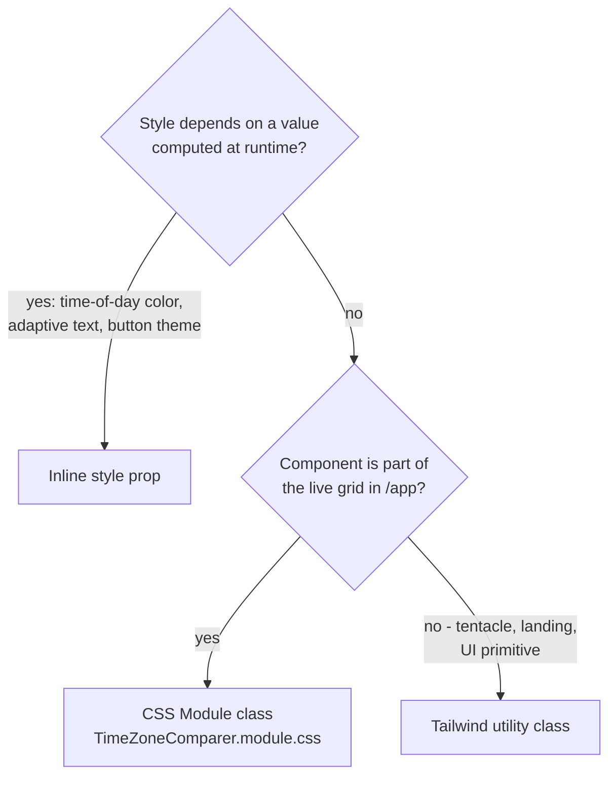

# Styling and Theming

How TZGrid handles styling: the two-layer approach, the day/night palette, adaptive button colors, and responsive breakpoints.

Source files: `src/lib/colors.ts`, `src/styles/TimeZoneComparer.module.css`, `src/components/Settings.tsx`, `src/components/TimeZoneComparer.tsx`, `tailwind.config.ts`. Related: [architecture.md](./architecture.md), [state-and-persistence.md](./state-and-persistence.md).

## Two-Layer Styling Approach



- **Tailwind** for landing, tentacle pages, UI primitives, and anywhere static utility classes are sufficient.
- **CSS Modules** for the live grid (`src/styles/TimeZoneComparer.module.css`). The grid has tightly coupled selectors, hover-revealed elements, and viewport-units-based padding that map awkwardly to utility classes.
- **Inline `style`** for any value computed from runtime state — column background colors, adaptive text colors, the CSS custom properties driving button theming.

## Tailwind Configuration

Standard Tailwind 3.4 with `tailwindcss-animate` and `tailwind-merge`. `darkMode: ["class"]` so the `dark` class on `<html>` toggles dark mode. `prose` and `prose-invert` are used heavily on tentacle and legal pages. CSS HSL custom properties drive the design tokens (defined in `globals.css`).

## CSS Module Roles — `TimeZoneComparer.module.css`

| Class | Role |
| --- | --- |
| `.container` | Full-viewport flex column. Hosts the `--button-color`, `--button-bg`, `--button-border` custom properties for adaptive UI chrome. Respects iOS safe-area insets via `env(safe-area-inset-*)`. |
| `.timezonesContainer` | Column-stack on mobile, switches to horizontal row at `min-width: 768px`. |
| `.timezoneColumn` | Per-timezone column. Receives the day/night background as an inline `style` prop. |
| `.topButtons` | Settings + reset cluster, top-right. Uses the `--button-*` custom properties so it stays legible over any background. |
| `.addButton` | Top-left circular plus button, 44×44px. Uses the same `--button-*` properties. |
| `.homeLink` | Bottom-left "TZGrid" wordmark. `mix-blend-mode: difference` so it auto-inverts against any background — this is the simplest path to legibility without recomputing per-frame. |
| `.timeContent` | Vertically positioned time block. On `≥ 768px` gets `padding-top: 30vh` to drop the time below the top buttons. |
| `.deleteIconWrapper`, `.addCustomLabelButton`, `.hoverCard` | Hover-revealed affordances, all `opacity: 0` until column hover. |

All interactive elements have `min-width: 44px; min-height: 44px` for touch-target compliance.

## The Day/Night Palette

`TIME_COLORS` in `src/lib/colors.ts` is an array of 25 anchor points (hours 0 through 24, with 0 and 24 sharing `#16053a` to close the loop):

| Hour | Color | Note |
| --- | --- | --- |
| 0 | `#16053a` | Deep purple, midnight |
| 1 | `#040B1D` | Darkest point of the night |
| 2 | `#030c1b` | |
| 3 | `#040F21` | |
| 4 | `#081930` | First hint of pre-dawn blue |
| 5 | `#1b475b` | |
| 6 | `#477a88` | Sunrise blue-grey |
| 7 | `#69aab1` | |
| 8 | `#93c6bc` | |
| 9 | `#c1dabe` | Pale green-yellow |
| 10 | `#e9ebb5` | |
| 11 | `#F5EB9F` | |
| 12 | `#f9e886` | Noon yellow |
| 13 | `#FEE56D` | Brightest point |
| 14 | `#fbcf63` | |
| 15 | `#F7B45B` | |
| 16 | `#f29b55` | |
| 17 | `#d37d5c` | |
| 18 | `#9a626a` | Sunset rose |
| 19 | `#6a4277` | |
| 20 | `#4D2971` | |
| 21 | `#2d1852` | |
| 22 | `#301755` | |
| 23 | `#0C052C` | |
| 24 | `#16053a` | (== hour 0) |

## Color Interpolation Algorithm

`getBackgroundColor(hour)` finds the two surrounding anchors and linearly interpolates each RGB channel:

```ts
ratio = (hour - lowerHour) / (upperHour - lowerHour)
r    = round(rLower + (rUpper - rLower) * ratio)
// ...same for g, b
```

`hour` is always a whole-number `parseInt` of the hour string from `Intl.DateTimeFormat` in `TimeZoneComparer`. Minutes and seconds do not influence the background. Because anchors are spaced one hour apart, the integer hour means the background steps cleanly at each hour boundary rather than animating continuously.

## Adaptive Text Color

`isLightColor(hex)` uses the W3C perceived-brightness formula:

```
brightness = (R * 299 + G * 587 + B * 114) / 1000
isLight    = brightness > 155
```

Threshold is 155 (slightly higher than the conventional 128) to bias the switch toward a darker text color earlier in the gradient transition. Returns `true` roughly between hours 9 and 16 — the daylight band where dark text reads better.

The grid uses this in two places: per-column text color, and the `--button-color` / `--button-bg` / `--button-border` custom properties applied to `.container`.

## Adaptive Button Theming

The top buttons (`.topButtons` and `.addButton`) sit fixed over a column whose background changes with time. To keep them legible regardless of which color is behind them, `TimeZoneComparer` picks an *anchor location* — the leftmost column on mobile, the rightmost on desktop (the columns the buttons actually overlap) — and writes its background color into three CSS custom properties:

- `--button-color` — text/icon color
- `--button-bg` — translucent background
- `--button-border` — subtle border

This was added in commit `d575f42` (`fix: top-right buttons adapt to the column behind them`). Without it, the buttons became unreadable over the bright midday yellows.

## Responsive Breakpoints

| Min width | Behaviour |
| --- | --- |
| < 640px | Columns stack vertically; hour and minute stacked vertically; clock font 1.8rem |
| ≥ 640px (`sm`) | Hour:minute inline with colon; clock font 3rem |
| ≥ 768px (`md`) | Columns switch to horizontal row; `.timeContent` gets `padding-top: 30vh`; secondary text scales up |
| ≥ 1024px (`lg`) | Clock font 4rem |
| ≥ 1200px (`xl`) | Clock font 5rem |

Source: media queries at the bottom of `TimeZoneComparer.module.css`.

## Theme Modes (Light, Dark, System)

Settings stores `theme: "light" | "dark" | "system"`. `Settings.tsx` toggles the `dark` class on `document.documentElement` accordingly:

- `light` — `dark` class removed.
- `dark` — `dark` class added.
- `system` — follows `prefers-color-scheme`; the toggle subscribes to the media query.

The day/night column gradients are independent of the theme mode. They are always driven by the column's local time of day. The theme mode affects the surrounding chrome — landing pages, modals, dialogs — not the per-timezone backgrounds.

## When To Touch Which File

| Change | File |
| --- | --- |
| Tweak a day/night color | `src/lib/colors.ts` (anchor table) |
| Adjust the brightness threshold for text inversion | `src/lib/colors.ts` (`isLightColor`) |
| Change column stack/row behaviour | `src/styles/TimeZoneComparer.module.css` (media queries) |
| New design token (light + dark) | `src/app/globals.css` (HSL custom properties) |
| New utility on a tentacle or landing page | `tailwind.config.ts` only if a new theme key is needed; otherwise just use existing utilities |
